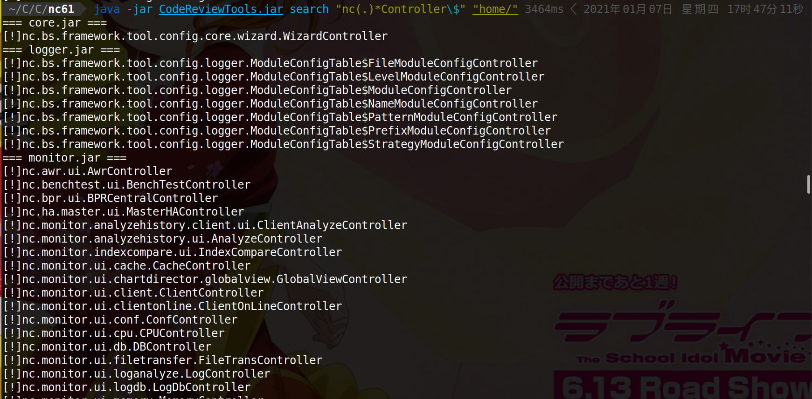
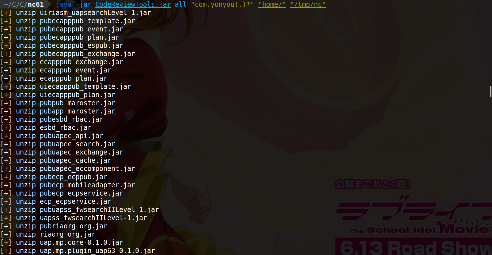
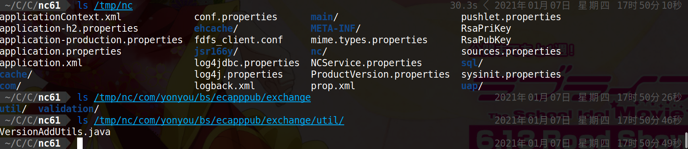

# CodeReviewTools

HW竞争越来越激烈的年代，谁能在指定时间内打下更多的点，谁就能在内网中抢下先机。

在HW项目中，在有源码的情况下为了快速冲下一个站，势必需要提升自己看代码的速度，寻找最薄弱的环节。

在做项目的时候发现几个问题，第一个就是拿到目标网站的war包载入idea，发现缺少某些class
第二个就是某些class被分包编译在不同的jar包里面

我们想快速搜索代码中的关键点，就必须得对jar包进行反编译。所以我写了CodeReviewTools

代码审计小工具，目前功能

- 通过正则搜索特定class名称
- 通过正则直接反编译拥有特定groupId的jar包到某个目录


### 例子
- 想快速寻找哪些jar包存在名为*Controller的jar文件

    ```java -jar CodeReviewTools.jar search "nc(.)*Controller\$" "home/"```

    

- 想快速解压jar包中包含groupId为com.yxxxx的jar并且反编译存储在/tmp/nc

    ```java -jar CodeReviewTools.jar all "com.yxxx(.)*" "home/lib" "/tmp/nc" ```
    
    

    效果：
    
  
### 感谢

[jd-core](https://github.com/java-decompiler/jd-core)