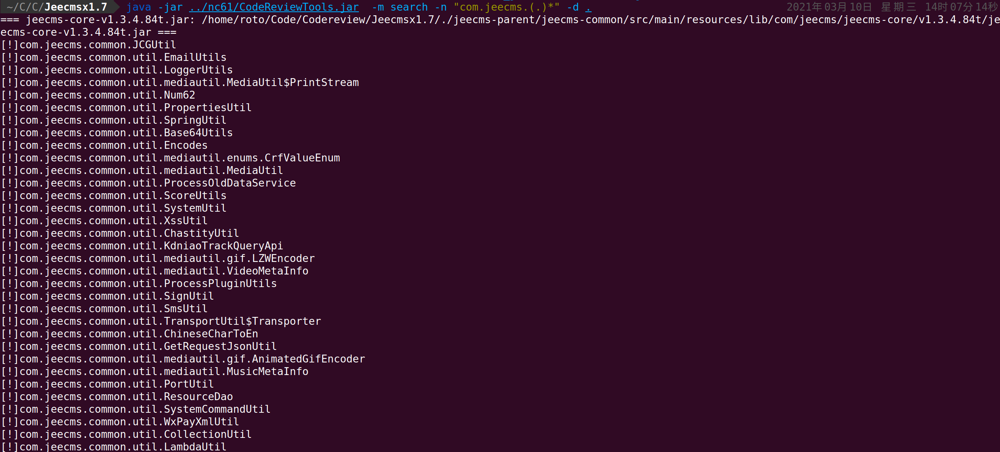
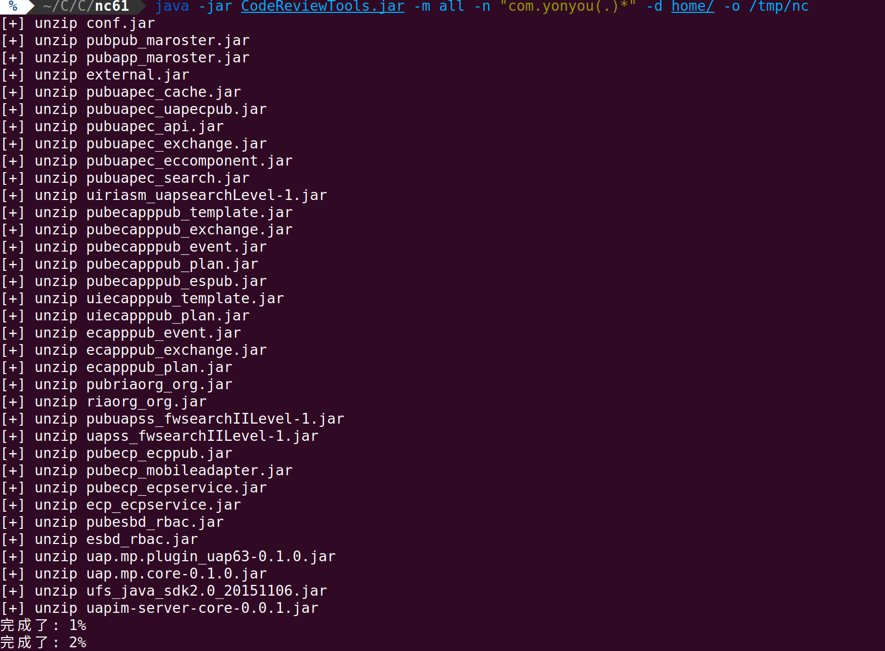
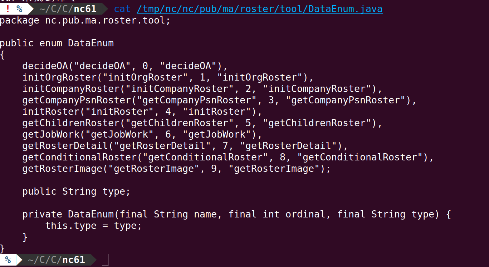

# CodeReviewTools 

---


## 🎉 介绍

HW竞争越来越激烈的年代，谁能在指定时间内打下更多的点，谁就能在内网中抢下先机。

在HW项目中，在有源码的情况下为了快速冲下一个站，势必需要提升自己看代码的速度，寻找最薄弱的环节。

在做项目的时候发现几个问题，第一个就是拿到目标网站的war包载入idea，发现缺少某些class
第二个就是某些class被分包编译在不同的jar包里面

我们想快速搜索代码中的关键点，就必须得对jar包进行反编译。所以我写了CodeReviewTools

## 🍭 目前功能

- 通过正则搜索特定class名称
- 通过正则直接反编译拥有特定groupId的jar包到某个目录

```
CodeReviewTools v1.0 by Ppsoft1991

usage: java -jar CodeReviewTools.jar -m <method>
-d,--dir <arg>      target path
-f,--file <arg>     target file
-h,--help           print help information
-m,--method <arg>   [search, unzip, decompiler, clear, all, war]
-n,--name <arg>     search class file or group name
-o,--output <arg>   output path
```


工具release版本使用jdk 11.0.9编译，如需要1.8版本请自行下载源码编译使用

## 💡 例子
- 想快速寻找哪些jar包存在名为*Controller的jar文件

    ```java -jar CodeReviewTools.jar -m search -n "nc(.)*Controller\$" -d "home/"```

    

- 想快速解压jar包中包含groupId为com.yxxxx的jar并且反编译存储在/tmp/nc

    ```java -jar CodeReviewTools.jar -m all -n "com.yxxx(.)*" -d "home/lib" -o "/tmp/nc" ```
    
    

    效果：
    

[](https://starchart.cc/Ppsoft1991/CodeReviewTools)

  
## ❤️ 感谢

[luyten](https://github.com/deathmarine/Luyten)


## ✔️ 版本更新

#### V1.0

- 重新做了命令行参数
- 反编译工具从jd-core变更为luyten (速度慢了不是一点半点，被迫使用线程池来进行反编译