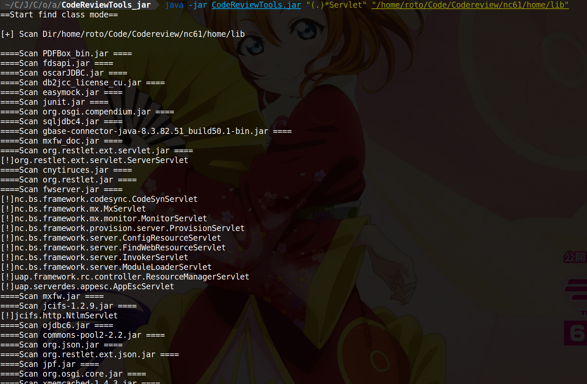
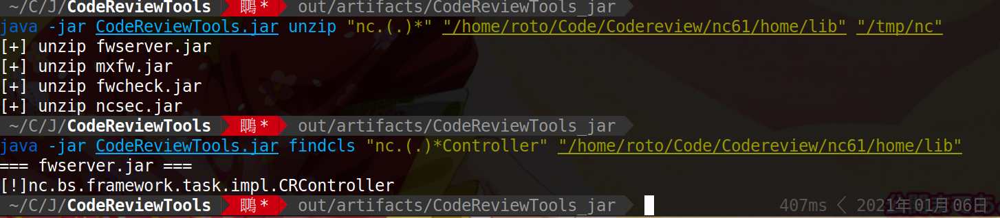

# CodeReviewTOOLS

代码审计小工具，目前功能

- 通过正则搜索特定class名称
- 通过正则解压特定groupId的jar包到某个目录

```java -jar findcls CodeReviewTools.jar "(.)*Servlet" "/home/roto/Code/Codereview/home/lib"```
```java -jar unzip CodeReviewTools.jar "com\.alibaba(.)*" "/home/roto/Code/Codereview/home/lib"```

